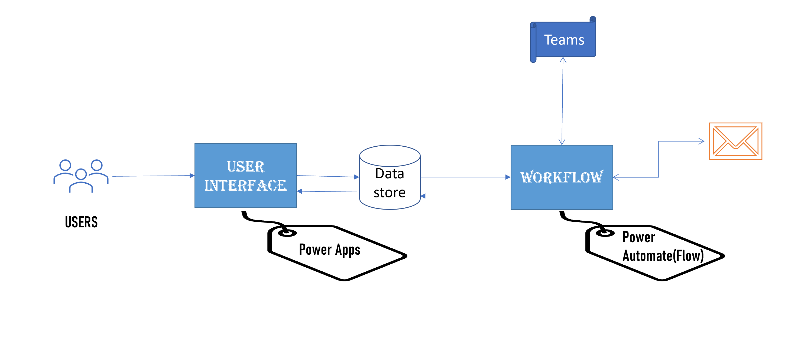

# 

## Overview

User Interface is built using Microsoft PowerApps and Workflow is built using Power Automate (Flows). Power Apps and Automate have connectors to various datastores, for our Demo we used Microsoft Lists and it has Email, Team connectors. 

## Github Repo folders

This Repo has apps and flows directories.

- apps/ - This has PowerApps related files and these can be imported into PowerApps platform.
- flows/ - This has Power Automate related files and these can be imported into Flows. 

